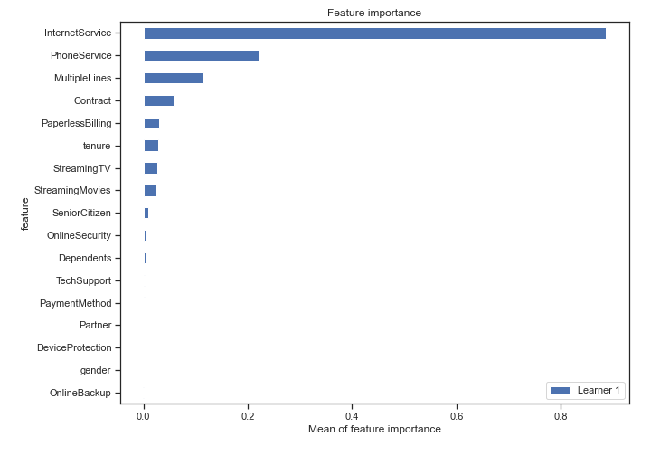

# Summary of 3_Linear

[<< Go back](../README.md)

## Linear Regression (Linear)
- **n_jobs**: -1
- **explain_level**: 2

## Validation
 - **validation_type**: split
 - **train_ratio**: 0.75
 - **shuffle**: True

## Optimized metric
rmse

## Training time

2.6 seconds

### Metric details:
| Metric   |       Score |
|:---------|------------:|
| MAE      |   24.9767   |
| MSE      | 1311.07     |
| RMSE     |   36.2087   |
| R2       |   -0.453491 |
| MAPE     |    0.354736 |

## Learning curves

## Coefficients
| feature          |   Learner_1 |
|:-----------------|------------:|
| PhoneService     |  0.331439   |
| MultipleLines    |  0.23399    |
| SeniorCitizen    |  0.186088   |
| PaperlessBilling |  0.132293   |
| tenure           |  0.12344    |
| StreamingTV      |  0.114673   |
| StreamingMovies  |  0.101905   |
| Partner          |  0.0281136  |
| DeviceProtection |  0.00990534 |
| OnlineBackup     | -0.00349964 |
| gender           | -0.00692233 |
| intercept        | -0.0300129  |
| Dependents       | -0.0480385  |
| TechSupport      | -0.0536996  |
| OnlineSecurity   | -0.0563761  |
| PaymentMethod    | -0.057153   |
| Contract         | -0.171523   |
| InternetService  | -0.669297   |

## Permutation-based Importance

## True vs Predicted

## Predicted vs Residuals

## SHAP Importance

## SHAP Dependence plots

### Dependence (Fold 1)

## SHAP Decision plots

### Top-10 Worst decisions (Fold 1)

### Top-10 Best decisions (Fold 1)

[<< Go back](../README.md)
