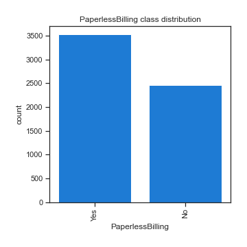

# Exploratory Data Analysis

[<< Go back](../README.md)
## Feature : target
- **Feature type** : continous
- **Missing** : 0.0%
- **Unique** : 1526
- **Count** :5986.0
- **Mean** :64.80221349816237
- **Std** :30.114701633888114
- **Min** :18.25
- **25%th Percentile** : 35.65
- **50%th Percentile** : 70.4
- **75%th Percentile** : 89.9
- **Max** :118.75

## Feature : gender
- **Feature type** : categorical
- **Missing** : 0.0%
- **Unique** : 2
- **Count** :5986
- **Unique** :2
- **Top** :Male
- **Freq** :3050

## Feature : SeniorCitizen
- **Feature type** : discrete
- **Missing** : 0.0%
- **Unique** : 2
- **Count** :5986.0
- **Mean** :0.16137654527230202
- **Std** :0.3679086410122601
- **Min** :0.0
- **25%th Percentile** : 0.0
- **50%th Percentile** : 0.0
- **75%th Percentile** : 0.0
- **Max** :1.0

## Feature : Partner
- **Feature type** : categorical
- **Missing** : 0.0%
- **Unique** : 2
- **Count** :5986
- **Unique** :2
- **Top** :No
- **Freq** :3082

## Feature : Dependents
- **Feature type** : categorical
- **Missing** : 0.0%
- **Unique** : 2
- **Count** :5986
- **Unique** :2
- **Top** :No
- **Freq** :4195

## Feature : tenure
- **Feature type** : discrete
- **Missing** : 0.0%
- **Unique** : 73
- **Count** :5986.0
- **Mean** :32.46876044102907
- **Std** :24.51639063752673
- **Min** :0.0
- **25%th Percentile** : 9.0
- **50%th Percentile** : 29.0
- **75%th Percentile** : 56.0
- **Max** :72.0

## Feature : PhoneService
- **Feature type** : categorical
- **Missing** : 0.0%
- **Unique** : 2
- **Count** :5986
- **Unique** :2
- **Top** :Yes
- **Freq** :5396

## Feature : MultipleLines
- **Feature type** : categorical
- **Missing** : 0.0%
- **Unique** : 3
- **Count** :5986
- **Unique** :3
- **Top** :No
- **Freq** :2848

## Feature : InternetService
- **Feature type** : categorical
- **Missing** : 0.0%
- **Unique** : 3
- **Count** :5986
- **Unique** :3
- **Top** :Fiber optic
- **Freq** :2627

## Feature : OnlineSecurity
- **Feature type** : categorical
- **Missing** : 0.0%
- **Unique** : 3
- **Count** :5986
- **Unique** :3
- **Top** :No
- **Freq** :2982

## Feature : OnlineBackup
- **Feature type** : categorical
- **Missing** : 0.0%
- **Unique** : 3
- **Count** :5986
- **Unique** :3
- **Top** :No
- **Freq** :2605

## Feature : DeviceProtection
- **Feature type** : categorical
- **Missing** : 0.0%
- **Unique** : 3
- **Count** :5986
- **Unique** :3
- **Top** :No
- **Freq** :2640

## Feature : TechSupport
- **Feature type** : categorical
- **Missing** : 0.0%
- **Unique** : 3
- **Count** :5986
- **Unique** :3
- **Top** :No
- **Freq** :2960

## Feature : StreamingTV
- **Feature type** : categorical
- **Missing** : 0.0%
- **Unique** : 3
- **Count** :5986
- **Unique** :3
- **Top** :No
- **Freq** :2389

## Feature : StreamingMovies
- **Feature type** : categorical
- **Missing** : 0.0%
- **Unique** : 3
- **Count** :5986
- **Unique** :3
- **Top** :No
- **Freq** :2356

## Feature : Contract
- **Feature type** : categorical
- **Missing** : 0.0%
- **Unique** : 3
- **Count** :5986
- **Unique** :3
- **Top** :Month-to-month
- **Freq** :3269

## Feature : PaperlessBilling
- **Feature type** : categorical
- **Missing** : 0.0%
- **Unique** : 2
- **Count** :5986
- **Unique** :2
- **Top** :Yes
- **Freq** :3528

## Feature : PaymentMethod
- **Feature type** : categorical
- **Missing** : 0.0%
- **Unique** : 4
- **Count** :5986
- **Unique** :4
- **Top** :Electronic check
- **Freq** :2006

[<< Go back](../README.md)
