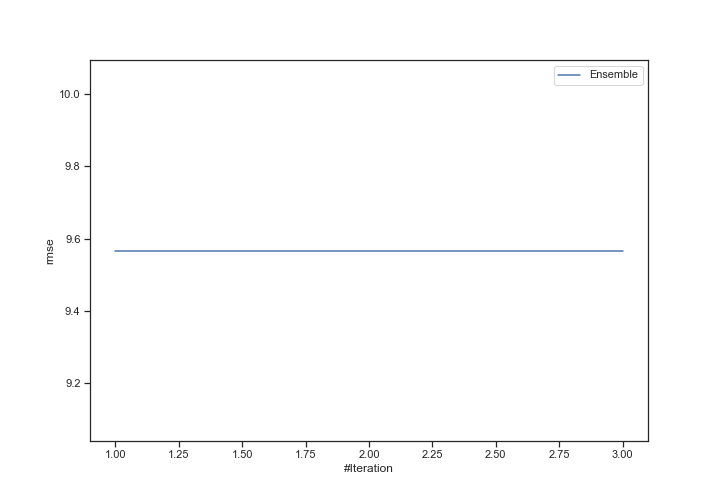
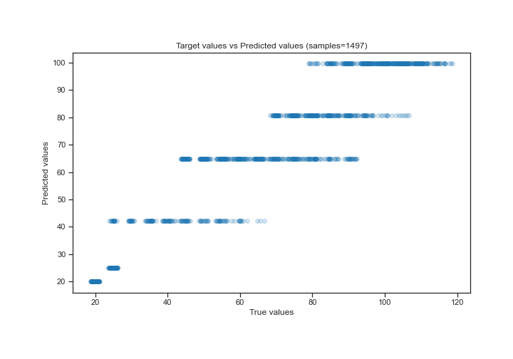
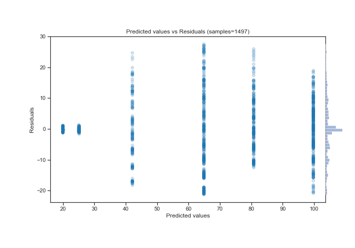

# Summary of Ensemble

[<< Go back](../README.md)

## Ensemble structure
| Model          |   Weight |
|:---------------|---------:|
| 2_DecisionTree |        1 |

### Metric details:
| Metric   |     Score |
|:---------|----------:|
| MAE      |  7.0634   |
| MSE      | 91.523    |
| RMSE     |  9.56677  |
| R2       |  0.898535 |
| MAPE     |  0.11159  |

## Learning curves

## True vs Predicted

## Predicted vs Residuals

[<< Go back](../README.md)
