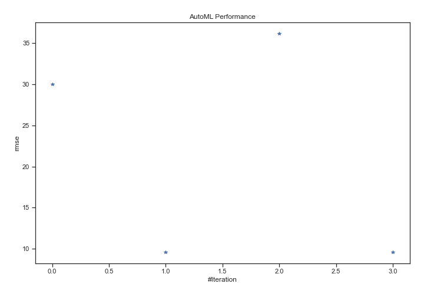
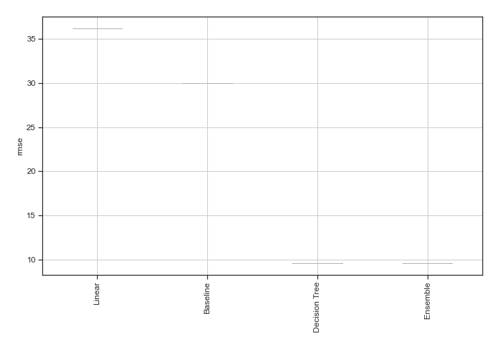
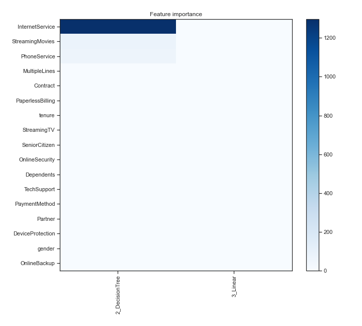
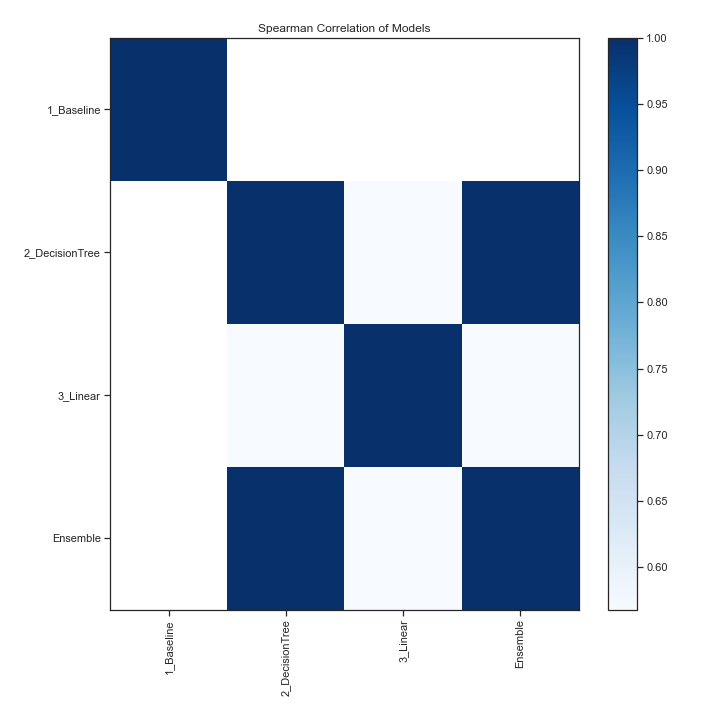

# AutoML Leaderboard

| Best model   | name                                       | model_type    | metric_type   |   metric_value |   train_time |
|:-------------|:-------------------------------------------|:--------------|:--------------|---------------:|-------------:|
|              | [1_Baseline](1_Baseline/README.md)         | Baseline      | rmse          |       30.0415  |         0.58 |
| **the best** | [2_DecisionTree](2_DecisionTree/README.md) | Decision Tree | rmse          |        9.56677 |        31.35 |
|              | [3_Linear](3_Linear/README.md)             | Linear        | rmse          |       36.2087  |         3.18 |
|              | [Ensemble](Ensemble/README.md)             | Ensemble      | rmse          |        9.56677 |         0.19 |

### AutoML Performance

### AutoML Performance Boxplot

### Features Importance

### Spearman Correlation of Models

